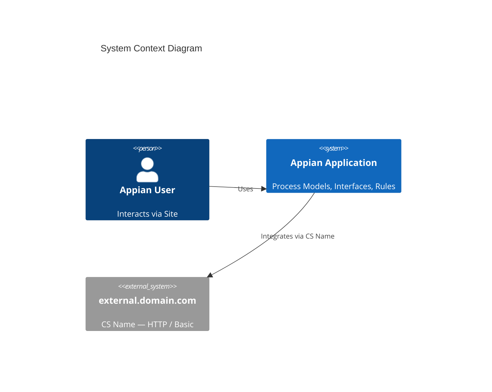

# C4Context Diagram — Style Reference

Based on the official Mermaid documentation: [C4 Diagrams](https://mermaid.js.org/syntax/c4.html)

## When to use

- To show the **system context**: who uses the application, what system it is, and which external systems it integrates with.
- Highest level of the C4 model (Simon Brown).
- Auto-generated by `extract_integrations.py` from `connectedSystem/*.xml`.

## Basic syntax



## Available elements

| Element | Use |
|---------|-----|
| `Person(alias, label, descr)` | System user |
| `System(alias, label, descr)` | The Appian application |
| `System_Ext(alias, label, descr)` | External system (one per Connected System) |
| `Boundary(alias, label)` | Logical grouping |
| `Rel(from, to, label)` | Relationship between elements |

## Customization

```
UpdateElementStyle(app, $bgColor="green", $fontColor="white")
UpdateRelStyle(app, ext0, $textColor="blue", $lineColor="blue")
```

## Auto-generation notes

- The script generates a generic `Person` ("Appian User") — the agent can enrich it with real roles if information is available in the export.
- One `System_Ext` is generated per Connected System, with the domain extracted from `baseUrl` and the authentication type.
- If the app has multiple Connected Systems, each appears as an independent external system.
- If there are no Connected Systems in the export, no C4 diagram is generated.

## C4 limitations in Mermaid

- Does not support custom icons (unlike `architecture-beta`).
- Layout is automatic, element position cannot be controlled.
- Tags/stereotypes are not fully implemented.
- For more detailed diagrams (C4Container, C4Component), information not available in a standard Appian export is required.
