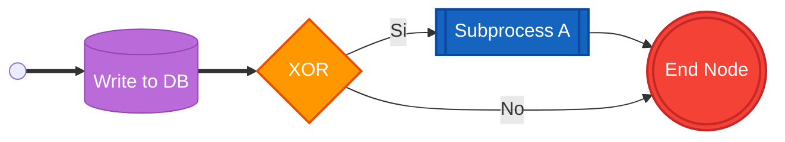
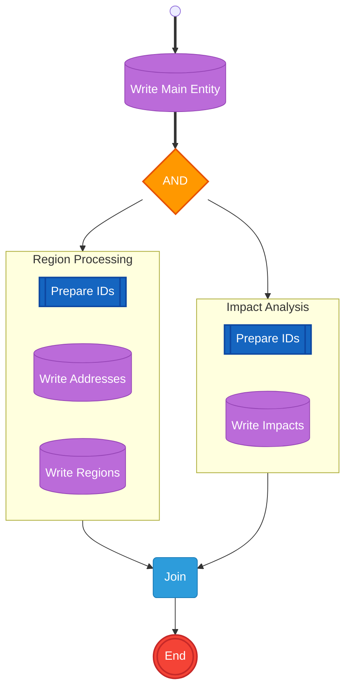

# Type Mapping & Visual Styling — BPMN Process Model Diagrams

Detailed rules for mapping Appian Process Model XML nodes to Mermaid shapes and BPMN color classes.
The `pm2mermaid.py` script implements this mapping automatically. These rules are the reference
for manual generation or for reviewing/enhancing script output.

## Contents
- [Type mapping rules](#type-mapping-rules)
  - [1. Events](#1-events--sm-circ--dbl-circ)
  - [2. Gateways](#2-gateways--diamond)
  - [3. Subprocess / Start Process](#3-subprocess--start-process--fr-rect)
  - [4. Data Smart Services](#4-data-smart-services--cyl-database-operations)
  - [5. Script Task](#5-script-task--rect)
  - [6. Human Tasks](#6-human-tasks--rounded)
  - [7. All other Smart Services](#7-all-other-smart-services--rect)
  - [Label extraction](#label-extraction)
- [Visual styling (BPMN 2.0 color coding)](#visual-styling-bpmn-20-color-coding)
  - [classDef block](#classdef-block)
  - [Class-to-node mapping table](#class-to-node-mapping-table)
  - [Class assignment syntax](#class-assignment-syntax)
  - [Legend link](#legend-link)
- [Examples](#examples)
  - [Small process](#example-with-styling-small-process)
  - [Large process with subgraphs](#example-with-subgraphs-large-process)
- [Post-script enhancement rules](#post-script-enhancement-rules)
  - [Click links for subprocesses](#click-links-for-subprocesses)
  - [Edge labels for XOR gateways](#edge-labels-for-xor-gateways)
  - [Dotted links for error/alternative flows](#dotted-links-for-erroralternative-flows)
  - [Thick links for main flow](#thick-links-for-main-flow)

---

## Type mapping rules

Nodes are detected from `<pm>/<nodes>/<node>`, connections from `<connections>/<connection>`.
Each node has `<ac>` with `<local-id>` and `<name>` that determine its type.

### 1. Events → `sm-circ` / `dbl-circ`
| `ac/local-id` | `ac/name` | Shape |
|---|---|---|
| `core.0` | Start Node | `sm-circ` (start) |
| `core.1` | End Node | `dbl-circ` (end) |
| `core.7` | Intermediate Consuming Event (Timer/Message) | `sm-circ` |

### 2. Gateways → `diamond`
| `ac/local-id` | `ac/name` | Label |
|---|---|---|
| `core.2` | AND | AND |
| `core.3` | OR | OR |
| `core.4` | XOR | XOR |
| `core.5` | Complex | Complex |

### 3. Subprocess / Start Process → `fr-rect`
| `ac/local-id` | `ac/name` | Notes |
|---|---|---|
| `internal.38` | SUB_PROC | **Only** this is a real subprocess |
| `appian.system.smart-services.start-process-*` | Start Process | Launches another process |

**WARNING**: Do NOT treat all `internal.*` as subprocesses, because most `internal.*` nodes are smart services (Send E-Mail, Call Integration, document operations, etc.). Incorrectly classifying them as subprocesses corrupts the BPMN shape mapping and produces misleading diagrams.

### 4. Data Smart Services → `cyl` (database operations)
| `ac/local-id` pattern | `ac/name` |
|---|---|
| `*write-to-data-store*` | Write to Data Store Entity / Write to Multiple |
| `*delete*data-store*` | Delete from Data Store Entities |
| `*data-export-entity*` | Export Data Store Entity to CSV/Excel |
| `*storedprocedure*` | Execute Stored Procedure |
| `*query-database*` | Query Database |
| `*write-records*` / `*delete-records*` | Write/Delete Records (newer Appian) |
| `*sync-records*` | Sync Records |
| Label contains "Write to", "Escritura BBDD" | (fallback by label pattern) |

### 5. Script Task → `rect`
| `ac/local-id` | `ac/name` | Notes |
|---|---|---|
| `internal.16` | Unattended Multiple Questions | **This is the Script Task** in Appian Designer. Despite `requires-user-interaction=true` in XML, it is NOT a user task. 185 instances found in real exports. |

**WARNING**: `requires-user-interaction` is unreliable because Appian sets it to `true` on almost all node types including Script Tasks (185 instances found in real exports). Using it to detect user tasks would incorrectly classify most nodes as human tasks.

### 6. Human Tasks → `rounded`
| `ac/local-id` | `ac/name` | Notes |
|---|---|---|
| `internal.17` | User Input Task | The **only** real user task with form interaction |

**WARNING**: Do NOT use `<form-map>` as a fallback to detect user tasks, because many smart services (Call Integration, Cancel Process, SFTP, Kafka, document operations, group operations) also have non-empty `<form-map>` for their input parameter configuration. Using `form-map` presence would produce false positives on most service tasks. Only `internal.17` is a user task.

### 7. All other Smart Services → `rect`
Everything else falls to `rect`. This includes:
- **Integration**: Call Integration (`internal3.integration`), Call Web Service, SFTP, Kafka, SAP
- **Notification**: Send E-Mail (`internal.sendemail2`), Send Push Notification
- **Document**: Generate Text (`internal.texttemplatemerge601`), PDF/Word from Template
- **Identity**: Add/Remove Group Members (`internal.19`, `internal2.removegroupmembers`), Create User/Group
- **Process**: Cancel Process, Complete Task
- **Excel**: Parse/Export Excel/CDT (`com.appiancorp.ps.exceltools.*`)
- **Content**: Copy/Delete/Lock Document (`com.appiancorp.ps.plugins.contenttools.*`)

### Label extraction
- Prefer the Spanish `fname` label (`locale country="" lang="es"`) if present; otherwise English; otherwise `ac/name`.
- Arrows are built with `N{guiId} --> N{to}` using `guiId` as the stable node ID.

---

## Visual styling (BPMN 2.0 color coding)

All diagrams MUST include `classDef` styles based on the BPMN 2.0 standard.

### classDef block
Copy the Palette B `classDef` block from [legend.md](legend.md#palette-b----process-models-diagramas-bpmn-20) to the END of every BPMN diagram.

### Class-to-node mapping table

| Class | BPMN type | Color | Appian nodes |
|---|---|---|---|
| `startEvent` | Start Event | 🟢 Green | `core.0` |
| `endEvent` | End Event | 🔴 Red | `core.1` |
| `timerEvent` | Intermediate Event | 🟡 Yellow | `core.7` (Timer/Message) |
| `gateway` | Gateway | 🟠 Orange | `core.2` AND, `core.3` OR, `core.4` XOR, `core.5` Complex |
| `subprocess` | Subprocess / Call Activity | 🔵 Dark Blue | `internal.38` SUB_PROC, `*start-process*` |
| `userTask` | User Task | 🔵 Light Blue | `internal.17` User Input Task |
| `serviceTask` | Service Task | 🟠 Light Orange | Call Integration, SFTP, Kafka, SAP |
| `scriptTask` | Script Task | ⚪ Gray | `internal.16` Script Task, and other unclassified |
| `sendTask` | Send Task | 🩷 Pink | Send E-Mail, Send Push Notification |
| `dataStore` | Data Store ops | 🟣 Purple | Write/Delete/Query Data Store, Stored Procedure |

### Class assignment syntax

Assign classes using `class` statements at the END (NOT `:::className` inline — incompatible with `@{ shape: ... }`):

```
  class N0 startEvent
  class N1 endEvent
  class N3,N7 gateway
  class N5 subprocess
  class N4 userTask
  class N8,N9 serviceTask
  class N10,N11 scriptTask
  class N12 sendTask
  class N2,N6 dataStore
```

### Legend link

Add a link to the shared legend file at the top of each `.md` file (outside the mermaid block):
```markdown
> Ver [leyenda de colores](./_legend.md)
```

---

## Examples

### Example with styling (small process)



### Example with subgraphs (large process)



Validate the Mermaid code and adjust labels before publishing.

---

## Post-script enhancement rules

After running `pm2mermaid.py`, review the generated diagrams and apply these enhancements manually:

### Click links for subprocesses
If a node is a subprocess (`ac/name == "SUB_PROC"`), add a click link to the corresponding subprocess diagram file:
```
click N15 "./APP_PM_SubprocessName.md" "Ver diagrama del subproceso"
```
This makes the node clickable in rendered Markdown (GitHub, VS Code preview), navigating to the subprocess diagram.
Resolve the subprocess name via the cross-reference index (Phase A of documenting-appian).

### Edge labels for XOR gateways
When a XOR gateway has exactly 2 outgoing edges, add condition labels:
```
N7 -->|"Si"| N5
N7 -->|"No"| N4
```
Infer the condition from:
- The connection's `<flowLabel>` if present in XML
- The node names downstream (e.g., one branch goes to a write, the other to a "Complex"/join = skip branch)
- If condition cannot be inferred, use `-->|"?"| ` to signal unknown condition

### Dotted links for error/alternative flows
If a connection represents an error or fallback path (inferred from node name containing "Error", "Exception", or going to an End node directly from a gateway), use dotted arrows:
```
N7 -.->|"Error"| N1
```

### Thick links for main flow
The primary path (Start → first activity → main gateway) can use thick arrows to highlight:
```
N0 ==> N2 ==> N3
```
