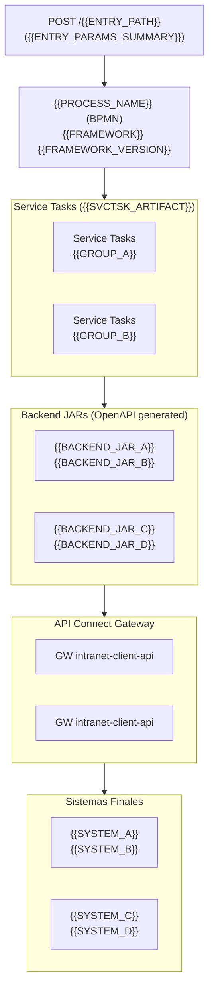
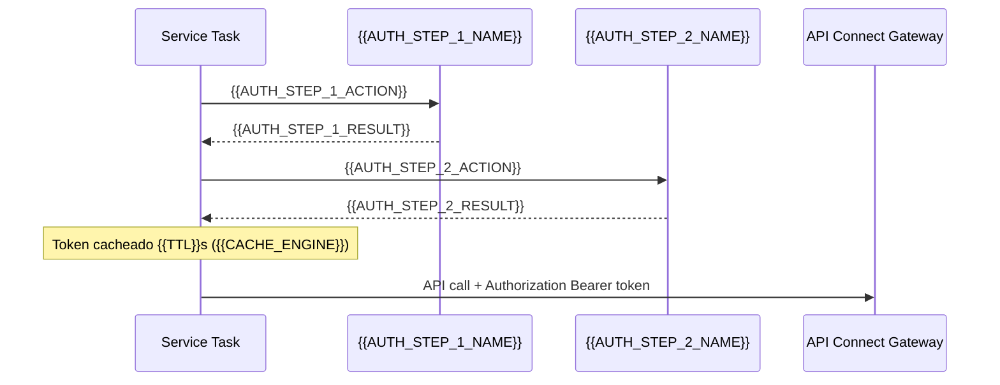
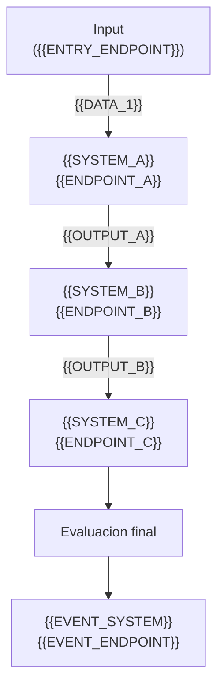
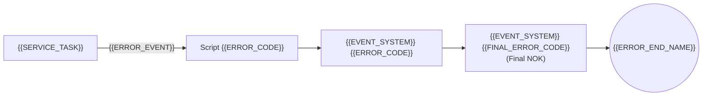

<!-- LANGUAGE NOTE: This template uses Spanish labels as examples. You MUST translate ALL labels, headings, descriptions, table headers, and notes to the language chosen by the user. Technical terms (Java classes, configKeys, field names) remain untranslated. -->\n\n# Documentacion Tecnica - {{PROJECT_DISPLAY_NAME}}

**Proyecto**: `{{ARTIFACT_ID}}` ({{SERVICE_DISPLAY_NAME}})
**Version**: {{VERSION}}
**Stack**: {{STACK_DESCRIPTION}}
**Dependencia Service Tasks**: `{{SVCTSK_DEPENDENCY}}`
**Fecha de generacion**: {{DATE}}

---

## Tabla de Contenidos

1. [Vision General de la Arquitectura](#1-vision-general-de-la-arquitectura)
2. [Punto de Entrada al Proceso](#2-punto-de-entrada-al-proceso)
3. [Seguridad - {{AUTH_PROVIDER}}](#3-seguridad---{{AUTH_ANCHOR}})
4. [Sistema 1 - {{SYSTEM_1_NAME}}](#4-sistema-1---{{SYSTEM_1_ANCHOR}})
5. [Sistema 2 - {{SYSTEM_2_NAME}}](#5-sistema-2---{{SYSTEM_2_ANCHOR}})
<!-- Anadir mas sistemas segun sea necesario -->
N. [Flujo Completo del Proceso BPMN](#n-flujo-completo-del-proceso-bpmn)
N+1. [Catalogo de Codigos de Evento](#n1-catalogo-de-codigos-de-evento)
N+2. [Mapa de Flujo de Datos entre Sistemas](#n2-mapa-de-flujo-de-datos-entre-sistemas)
N+3. [Configuracion de Entornos](#n3-configuracion-de-entornos)
N+4. [Headers Comunes](#n4-headers-comunes)
N+5. [Gestion de Errores Transversal](#n5-gestion-de-errores-transversal)


## 1. Vision General de la Arquitectura

### Diagrama de Arquitectura



### Backends generados desde OpenAPI

| Backend JAR | Version | Sistema destino |
|---|---|---|
| `{{BACKEND_JAR_1}}` | {{VERSION_1}} | {{SYSTEM_NAME_1}} |
| `{{BACKEND_JAR_2}}` | {{VERSION_2}} | {{SYSTEM_NAME_2}} |
<!-- Anadir una fila por cada backend JAR detectado en pom.xml -->

---

## 2. Punto de Entrada al Proceso

### Endpoint REST

| Campo | Valor |
|---|---|
| **Metodo** | `POST` |
| **Path** | `/{{ENTRY_PATH}}` |
| **Content-Type** | `application/json` |
| **Proceso BPMN** | `{{BPMN_PROCESS_ID}}` |
| **Clase Config** | `{{PACKAGE}}.{{CONFIG_CLASS}}` |

{{DESCRIPCION_CLASE_CONFIG: Describir brevemente que hace la clase de configuracion del proceso (parseo de datos, inyeccion de variables, etc.)}}

### Request Body - `{{REQUEST_DTO_CLASS}}`

| Campo | Tipo | Descripcion |
|---|---|---|
| `{{FIELD_1}}` | `{{TYPE_1}}` | {{DESCRIPTION_1}} |
| `{{FIELD_2}}` | `{{TYPE_2}}` | {{DESCRIPTION_2}} |
<!-- Anadir todos los campos del DTO de entrada -->

### {{SPECIFIC_DATA_FIELD}} - `{{SPECIFIC_DATA_DTO_CLASS}}`

> Solo incluir esta subseccion si el punto de entrada contiene un campo JSON embebido (como specificData) que se parsea en variables del proceso.

| Campo | Tipo | Tags | Descripcion |
|---|---|---|---|
| `{{VAR_1}}` | `{{TYPE}}` | required, input | {{DESCRIPTION}} |
| `{{VAR_2}}` | `{{TYPE}}` | required, input | {{DESCRIPTION}} |

### JSON de ejemplo - Request

```json
{
  "{{field1}}": "{{value1}}",
  "{{field2}}": "{{value2}}"
}
```

### JSON de ejemplo - Response (exito 200 OK)

```json
{
  "id": "{{PROCESS_INSTANCE_ID}}",
  "{{OUTPUT_FIELD}}": { }
}
```

### JSON de ejemplo - Response (error 400/500)

```json
{
  "{{ERROR_FIELD_1}}": null,
  "errors": [
    {
      "code": "{{ERROR_CODE}}",
      "description": "{{ERROR_DESC}}",
      "level": "ERROR",
      "message": "{{ERROR_MSG}}"
    }
  ]
}
```

### Variables del Proceso BPMN

| Variable | Tipo Java | Tags | Uso |
|---|---|---|---|
| `{{VAR}}` | `{{JAVA_TYPE}}` | input, required | {{DESCRIPTION}} |
| `{{VAR}}` | `{{JAVA_TYPE}}` | internal | {{DESCRIPTION}} |
| `{{VAR}}` | `{{JAVA_TYPE}}` | output | {{DESCRIPTION}} |
<!-- Listar TODAS las variables del proceso BPMN extraidas de itemDefinition[@structureRef] -->

---

## 3. Seguridad - {{AUTH_PROVIDER}}

{{DESCRIPCION_SEGURIDAD: Describir el flujo de autenticacion usado para las llamadas a APIs externas.}}

### REST Clients de Seguridad

| configKey | URL DEV | URL PROD |
|---|---|---|
| `{{AUTH_CONFIG_KEY_1}}` | `{{AUTH_URL_DEV_1}}` | `{{AUTH_URL_PROD_1}}` |
| `{{AUTH_CONFIG_KEY_2}}` | `{{AUTH_URL_DEV_2}}` | `{{AUTH_URL_PROD_2}}` |

### Flujo de obtencion de token



### Clases involucradas

- **`{{TOKEN_REST_CLIENT_1}}`** - {{DESCRIPTION_1}}
- **`{{TOKEN_REST_CLIENT_2}}`** - {{DESCRIPTION_2}}
- **`{{TOKEN_MANAGER}}`** - {{DESCRIPTION_3}}

### Cache de tokens

| Parametro | Valor |
|---|---|
| **Motor** | {{CACHE_ENGINE}} |
| **Nombre cache** | `{{CACHE_NAME}}` |
| **TTL** | {{TTL}} segundos |

```properties
{{CACHE_CONFIG_PROPERTY}}
```

---

## 4. Sistema 1 - {{SYSTEM_1_NAME}}

### Descripcion

{{SYSTEM_DESCRIPTION: Describir el sistema, su funcion dentro del proceso y para que se utiliza. Usar lista numerada con los usos principales:}}
1. **{{USO_1_ACCION}}** {{USO_1_DETALLE}}
2. **{{USO_2_ACCION}}** {{USO_2_DETALLE}}

### Configuracion REST Client

| Campo | Valor |
|---|---|
| **configKey** | `{{CONFIG_KEY}}` |
| **URL DEV** | `{{URL_DEV}}` |
| **URL PROD** | `{{URL_PROD}}` |
| **Interface Java** | `{{PACKAGE}}.{{INTERFACE_CLASS}}` |
| **Base path** | `/{{BASE_PATH}}` |
| **Service Task** | `{{PACKAGE}}.{{SERVICE_TASK_CLASS}}` |
| **Backend JAR** | `{{BACKEND_JAR}}:{{VERSION}}` |

### Endpoint {{N}}.1: {{ENDPOINT_NAME}} ({{LECTURA_O_ESCRITURA}})

| Campo | Valor |
|---|---|
| **HTTP** | `{{METHOD}} /{{PATH}}` |
| **Content-Type** | `application/json` |
| **Nombre BPMN** | "{{BPMN_TASK_NAME}}" |
| **Metodo Service Task** | `{{SERVICE_TASK_METHOD}}({{PARAMS}})` |
| **Inputs BPMN** | `{{INPUT_VAR_1}}`, `{{INPUT_VAR_2}}` |
| **Output BPMN** | `{{OUTPUT_VAR}}` |

#### Query Parameters

> Incluir solo si el endpoint tiene query o path parameters.

| Parametro | Tipo | Requerido | Descripcion |
|---|---|---|---|
| `{{PARAM}}` | {{TYPE}} | Si/No | {{DESCRIPTION}} |

#### Request Body DTO - `{{REQUEST_DTO_CLASS}}`

> Incluir solo si el endpoint tiene request body (POST/PUT).

| Campo | Tipo | Descripcion |
|---|---|---|
| `{{FIELD}}` | `{{TYPE}}` | {{DESCRIPTION}} |

#### Response DTO - `{{RESPONSE_DTO_CLASS}}`

**Clase**: `{{FULL_QUALIFIED_CLASS}}`

| Campo | Tipo | Descripcion |
|---|---|---|
| `{{FIELD}}` | `{{TYPE}}` | {{DESCRIPTION}} |

#### Output Service Task - `{{OUTPUT_DTO_CLASS}}`

| Campo | Tipo | Descripcion |
|---|---|---|
| `{{FIELD}}` | `{{TYPE}}` | {{DESCRIPTION}} |
| `eventInfo` | `EventInfo` | Informacion del evento para trazabilidad |

#### Logica de decision

- `{{CONDICION_1}}` -> {{RESULTADO_1}}
- `{{CONDICION_2}}` -> evento {{EVENT_CODE}} -> {{RESULTADO_2}}

#### JSON de ejemplo - Request

```http
{{METHOD}} /{{PATH}}?{{QUERY_PARAMS}}
Accept: application/json
Authorization: Bearer <token>
x-client-id: {{CLIENT_ID}}
```

```json
// Solo si es POST/PUT - Request real anonimizado
{
  "{{FIELD}}": "{{VALUE}}"
}
```

#### JSON de ejemplo - Response {{STATUS_CODE}}

```json
// Respuesta real anonimizada (basada en ejecucion {{ENV}} {{DATE}})
{
  "{{FIELD}}": "{{VALUE}}"
}
```

### Endpoint {{N}}.2: {{ENDPOINT_NAME}} ({{LECTURA_O_ESCRITURA}})

<!-- Repetir el patron del Endpoint N.1 para cada endpoint adicional del sistema -->

#### Output Service Task - `{{OUTPUT_DTO_CLASS}}`

| Campo | Tipo | Descripcion |
|---|---|---|
| `{{FIELD}}` | `{{TYPE}}` | {{DESCRIPTION}} |

#### Logica de decision

- Exito -> evento {{EVENT_CODE_OK}}
- Exito parcial -> evento {{EVENT_CODE_WARN}}
- Error (boundary `{{ERROR_NAME}}`) -> evento {{EVENT_CODE_ERR}} -> {{ERROR_ACTION}}

#### JSON de ejemplo - Request

```json
// Request real anonimizado - {{METHOD}} /{{PATH}}
{
}
```

#### JSON de ejemplo - Response {{STATUS_CODE}} (real anonimizado)

```json
{
}
```

### Endpoints adicionales

> Incluir solo si hay endpoints GET auxiliares no directamente en el flujo BPMN.

| Metodo | Path | Descripcion |
|---|---|---|
| `GET` | `/{{PATH}}/{id}` | {{DESCRIPTION}} |

---

<!-- REPETIR la seccion del Sistema (misma estructura) para cada sistema externo detectado -->
<!-- Cada sistema debe seguir EXACTAMENTE la misma estructura de subsecciones -->

---

## N. Flujo Completo del Proceso BPMN

### Diagrama de secuencia

```mermaid
flowchart TD
    START(("START"))

    subgraph FASE1["Fase 1: {{PHASE_1_NAME}}"]
        {{PHASE_1_TASKS_AND_GATEWAYS}}
    end

    START --> FASE1

    subgraph FASE2["Fase 2: {{PHASE_2_NAME}}"]
        {{PHASE_2_TASKS_AND_GATEWAYS}}
    end

    subgraph FASE3["Fase 3: {{PHASE_3_NAME}}"]
        subgraph RAMA_A["Rama A: {{BRANCH_A_NAME}}"]
            {{BRANCH_A_TASKS}}
        end
        subgraph RAMA_B["Rama B: {{BRANCH_B_NAME}}"]
            {{BRANCH_B_TASKS}}
        end
    end

    subgraph FASE4["Fase 4: {{PHASE_4_NAME}}"]
        {{FINAL_EVALUATION_TASKS}}
    end
```

> El diagrama debe reflejar TODAS las fases del proceso BPMN, incluyendo:
> - Subgraphs por fase
> - Gateways con condiciones en las flechas
> - Ramas paralelas con inclusive/parallel gateways (fork + join)
> - Caminos de error con terminadores
> - Script tasks de evaluacion final

### Logica del script de evaluacion final

> Incluir solo si el proceso BPMN tiene un script task de evaluacion final.

```java
// Extraido directamente del BPMN
{{EVALUATION_SCRIPT_CODE}}
```

---

## N+1. Catalogo de Codigos de Evento

| Codigo | Fase | Significado | isError | Log en BPMN |
|--------|------|-------------|---------|-------------|
| **{{CODE}}** | {{PHASE}} | {{MEANING}} | {{true/false}} | "{{LOG_MESSAGE}}" |
<!-- Listar TODOS los codigos de evento, ordenados numericamente -->
<!-- Los codigos deben coincidir con los mencionados en las secciones de cada sistema -->

---

## N+2. Mapa de Flujo de Datos entre Sistemas



> El diagrama debe mostrar:
> - Que datos entran a cada sistema (etiquetas en las flechas)
> - Que output de un sistema alimenta a otro
> - Las dependencias entre sistemas (orden de ejecucion)

---

## N+3. Configuracion de Entornos

### URLs de APIs por entorno

| Sistema | DEV (WireMock) | CERT/PRE/PRO |
|---|---|---|
| {{SYSTEM_1}} | `{{URL_DEV_1}}` | `{{URL_PROD_1}}` |
| {{SYSTEM_2}} | `{{URL_DEV_2}}` | `{{URL_PROD_2}}` |
<!-- Una fila por cada sistema/REST client -->

Donde `{env}` = `dev`, `cert`, `pre` o `pro`.

### Despliegue {{CLOUD_PLATFORM}}

| Entorno | Namespace K8s | Cluster | Region | Account |
|---|---|---|---|---|
| **CERT** | `{{NS_CERT}}` | `{{CLUSTER_CERT}}` | {{REGION}} | {{ACCOUNT_CERT}} |
| **PRE** | `{{NS_PRE}}` | `{{CLUSTER_PRE}}` | {{REGION}} | {{ACCOUNT_PRE}} |
| **PRO** | `{{NS_PRO}}` | `{{CLUSTER_PRO}}` | {{REGION}} | {{ACCOUNT_PRO}} |

### Imagen Docker

- **Registry**: `{{DOCKER_REGISTRY}}`
- **Image**: `{{DOCKER_IMAGE}}`

### Base de datos

- **Motor**: {{DB_ENGINE}}
- **Host CERT**: `{{DB_HOST_CERT}}`
- **Database**: `{{DB_NAME}}`
- **Schemas**: {{DB_SCHEMAS}}
- **Persistencia**: {{PERSISTENCE_TYPE}}

### Messaging ({{MESSAGING_PLATFORM}})

> Incluir solo si el proyecto usa mensajeria.

- **Brokers**: {{BROKER_TYPE}}
- **Seguridad**: {{BROKER_SECURITY}}
- **Topics**:
  - `{{TOPIC_1}}`
  - `{{TOPIC_2}}`

### WireMock (solo DEV)

| Parametro | Valor |
|---|---|
| **Puerto** | {{WIREMOCK_PORT}} |
| **Mappings** | `{{WIREMOCK_PATH}}` |
| **Recarga automatica** | Si |

---

## N+4. Headers Comunes

Todas las APIs comparten estos headers en las llamadas HTTP:

| Header | Descripcion | Obligatorio |
|---|---|---|
| `Authorization` | Bearer token {{AUTH_PROVIDER}} | Si |
| `x-client-id` | ID del cliente | Si |
| `Content-Type` | `application/json` | Si |
| `x-b3-traceid` | B3 Trace ID (distributed tracing) | No |
| `x-b3-spanid` | B3 Span ID | No |
| `x-b3-sampled` | B3 Sampling flag | No |
<!-- Anadir headers adicionales detectados en el codigo -->

---

## N+5. Gestion de Errores Transversal

### Tipos de error BPMN

> Incluir solo si el proyecto tiene procesos BPMN.

El proceso define los siguientes errores BPMN con boundary events:

| Error Code | Descripcion | Ubicacion |
|---|---|---|
| `{{ERROR_CODE}}` | {{ERROR_DESCRIPTION}} | {{BPMN_SUBPROCESS}} |

### Patron de gestion de errores

1. **Cada Service Task** devuelve un output con `eventInfo` que contiene un `code`
2. Los **codigos terminados en 1** (ej: 101, 201, 301) indican exito
3. Los **codigos terminados en 2** (ej: 102, 202, 302) indican exito parcial (warnings)
4. Los **codigos terminados en 3** (ej: 103, 203, 303) indican error
5. El **script de evaluacion final** comprueba combinaciones de codigos para determinar el resultado global
6. **Boundary error events** capturan excepciones Java y redirigen a flujos de error con eventos de trazabilidad

> Adaptar el patron de codigos al esquema real del proyecto. El patron X01/X02/X03 es el mas comun pero no el unico.

### Flujo de error - {{ERROR_FLOW_NAME}}



<!-- Repetir un diagrama de flujo de error por cada patron de error distinto en el BPMN -->

---

> **NOTA**: Los DTOs han sido extraidos por decompilacion de los JARs generados desde OpenAPI. Los JSON de ejemplo son aproximaciones basadas en las estructuras de campos y en el analisis del BPMN. Para JSON exactos al 100%, se requeriria acceder a las especificaciones OpenAPI originales o a los mocks de WireMock.
