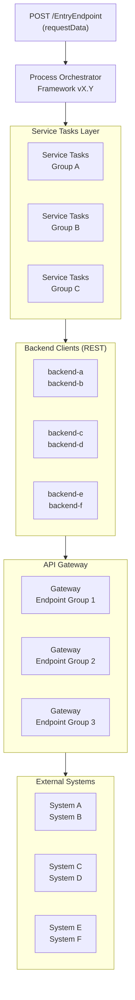
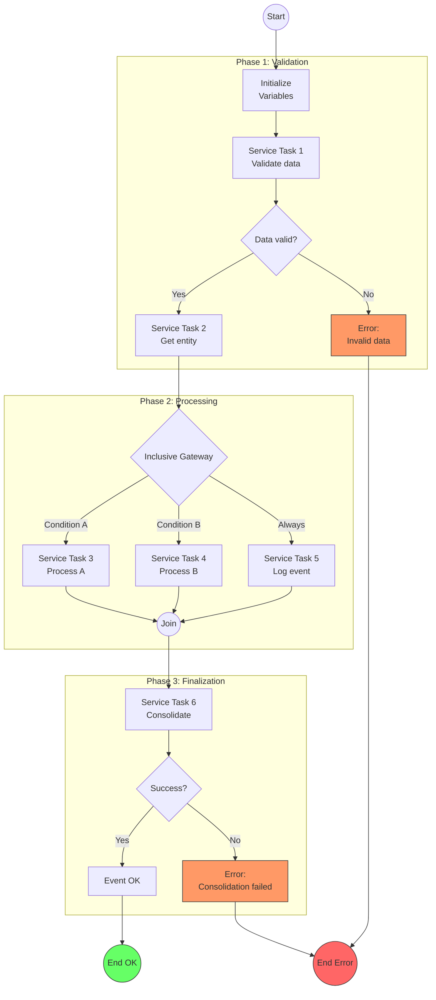
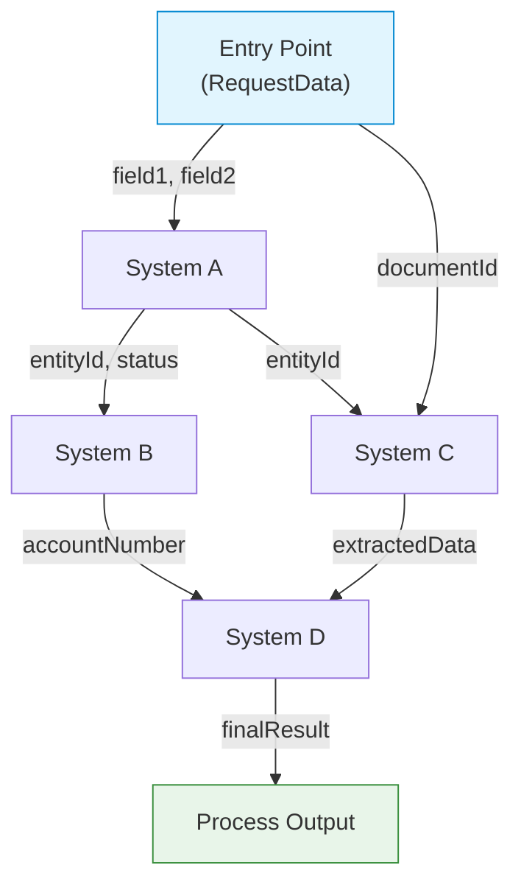
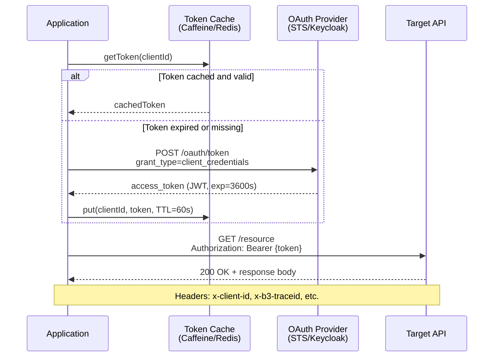
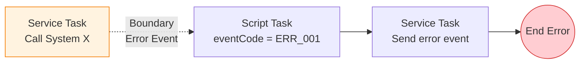
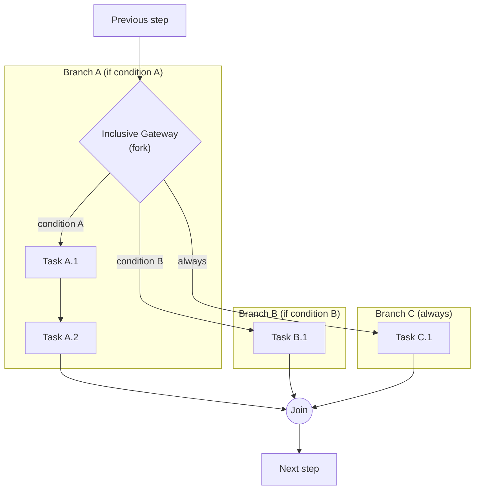

# Diagram Patterns — Mermaid

Proven and validated Mermaid patterns for technical documentation. Each pattern includes a complete example and guidance on when to use it.

> **IMPORTANT**: Validate Mermaid syntax before including in the document. Avoid unescaped special characters in labels. Use double quotes `"label"` for labels with spaces or special characters.

## Table of Contents

- [1. Multi-layer Architecture](#1-multi-layer-architecture)
- [2. BPMN Process Flow](#2-bpmn-process-flow)
- [3. Data Flow Map](#3-data-flow-map)
- [4. Authentication Sequence](#4-authentication-sequence)
- [5. Error Flow (Compact)](#5-error-flow-compact)
- [6. Inclusive / Parallel Gateway (Fork-Join)](#6-inclusive--parallel-gateway-fork-join)
- [General Mermaid Notes](#general-mermaid-notes)

---

## 1. Multi-layer Architecture

**When to use**: Project overview showing how requests flow from the entry point to the final external systems.



**Tips**:
- Use `subgraph` to group components by layer
- `direction LR` inside subgraphs for horizontal layout of components in the same layer
- Labels with `\n` to show additional info (versions, names)
- Keep a maximum of 4-5 vertical layers for readability

---

## 2. BPMN Process Flow

**When to use**: Document the complete flow of a BPMN process with phases, gateways, decisions, and error paths.



**Tips**:
- Use `subgraph` per process phase
- Gateways with `{}` (diamond shape) and descriptive labels
- `((""))` for start/end events (circles)
- `style` to color error terminators (red) and success (green)
- Inclusive gateways: show all branches and the join point

---

## 3. Data Flow Map

**When to use**: Show what data flows between systems, what output from one system feeds into which input of another.



**Tips**:
- Arrow labels `-->|"data"|` show what data flows
- Color entry (blue) and output (green) for clarity
- Do not include decision logic, only data flow
- Useful for identifying inter-system dependencies

---

## 4. Authentication Sequence

**When to use**: Document the OAuth2/OIDC token retrieval flow with caching.



**Tips**:
- `alt`/`else` for conditional branching
- `Note over` for contextual information
- `<br/>` for line breaks in participant labels
- Participants named with short but descriptive aliases

---

## 5. Error Flow (Compact)

**When to use**: Document how an error is handled in a specific Service Task within the BPMN.



**Tips**:
- `flowchart LR` for horizontal layout (compact)
- `-.->` (dashed line) for boundary events
- One diagram per distinct error pattern
- Keep a maximum of 4-5 nodes for readability

---

## 6. Inclusive / Parallel Gateway (Fork-Join)

**When to use**: Document parallel or conditional execution of multiple branches that then converge.



**Tips**:
- `subgraph` per branch for visual grouping
- Label on each fork arrow indicating the condition
- "always" for branches that execute unconditionally
- Join as `((""))` node to indicate convergence

---

## General Mermaid Notes

1. **Escape characters**: Use double quotes for labels with parentheses, brackets, or special characters: `["Label (with parens)"]`
2. **Node IDs**: Use short, descriptive IDs without spaces: `ST1`, `GW_FORK`, `END_OK`
3. **Label length**: Keep labels < 40 characters. Use `\n` to split long lines
4. **Colors**: Use `style` sparingly, only to highlight errors (red), successes (green), or entries (blue)
5. **Size**: Keep diagrams < 30 nodes. If larger, split into sub-diagrams
6. **Validation**: ` ```mermaid ` blocks render in GitHub and in the exported HTML. Verify syntax before including.
