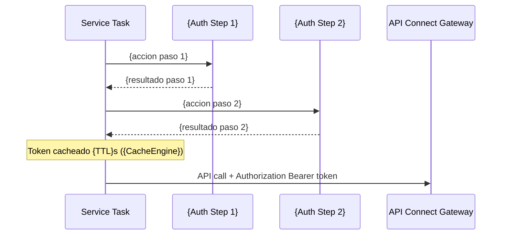
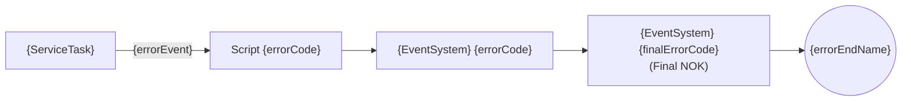
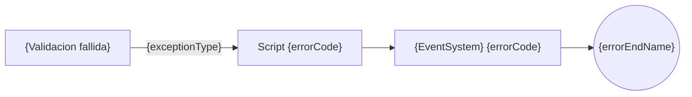

# Plantillas de Documentacion

Plantillas Markdown reutilizables para cada tipo de seccion recurrente en la documentacion tecnica.

> **LANGUAGE NOTE**: All labels, headings, table headers, and descriptions in these templates are shown in Spanish as examples. You MUST translate them to the language chosen by the user. Technical terms (Java class names, configKeys, field names) remain untranslated.

## Tabla de Contenidos

- [Plantilla: Sistema Externo / Integracion](#plantilla-sistema-externo--integracion)
- [Plantilla: Punto de Entrada REST](#plantilla-punto-de-entrada-rest)
- [Plantilla: Tabla DTO](#plantilla-tabla-dto)
- [Plantilla: Variables del Proceso BPMN](#plantilla-variables-del-proceso-bpmn)
- [Plantilla: Catalogo de Codigos de Evento](#plantilla-catalogo-de-codigos-de-evento)
- [Plantilla: Configuracion de Entornos](#plantilla-configuracion-de-entornos)
- [Plantilla: Headers Comunes](#plantilla-headers-comunes)
- [Plantilla: Seccion de Seguridad](#plantilla-seccion-de-seguridad)
- [Plantilla: Gestion de Errores](#plantilla-gestion-de-errores)

---

## Plantilla: Sistema Externo / Integracion

> Cada sistema externo sigue **exactamente** esta estructura de subsecciones.
> El orden de subsecciones es obligatorio: Descripcion → Configuracion REST Client → Endpoints (con sub-secciones) → Endpoints adicionales.

````markdown
## {N}. Sistema {N} - {NOMBRE_SISTEMA}

### Descripcion

{Descripcion del sistema, su rol en el proceso y para que se utiliza. Usar lista numerada con los usos principales:}
1. **{Accion 1}** {detalle de lo que hace en el proceso}
2. **{Accion 2}** {detalle de lo que hace en el proceso}

### Configuracion REST Client

| Campo | Valor |
|---|---|
| **configKey** | `{config-key}` |
| **URL DEV** | `{url-dev-completa}` |
| **URL PROD** | `{url-prod-con-placeholder-env}` |
| **Interface Java** | `{paquete.completo.InterfazJava}` |
| **Base path** | `/{base-path}` |
| **Service Task** | `{paquete.completo.ServiceTaskClass}` |
| **Backend JAR** | `{artifact-id}:{version}` |

### Endpoint {N}.1: {Nombre del endpoint} ({LECTURA/ESCRITURA})

| Campo | Valor |
|---|---|
| **HTTP** | `{METHOD} /{path}` |
| **Content-Type** | `application/json` |
| **Nombre BPMN** | "{Nombre del Service Task en el BPMN}" |
| **Metodo Service Task** | `{metodoJava}({param1}, {param2})` |
| **Inputs BPMN** | `{var1}`, `{var2}` |
| **Output BPMN** | `{variableOutput}` |

#### Query Parameters

| Parametro | Tipo | Requerido | Descripcion |
|---|---|---|---|
| `{param}` | String | Si | {Descripcion} |

#### Request Body DTO - `{RequestDtoClass}`

> Solo incluir si el endpoint tiene request body (POST/PUT).

| Campo | Tipo | Descripcion |
|---|---|---|
| `{campo}` | `{TipoJava}` | {Descripcion} |

**{SubDto}**:

| Campo | Tipo | Descripcion |
|---|---|---|
| `{campo}` | `{TipoJava}` | {Descripcion} |

#### Response DTO - `{ResponseDtoClass}`

**Clase**: `{paquete.completo.ResponseDtoClass}`

| Campo | Tipo | Descripcion |
|---|---|---|
| `{campo}` | `{TipoJava}` | {Descripcion} |

#### Output Service Task - `{OutputDtoClass}`

| Campo | Tipo | Descripcion |
|---|---|---|
| `{campo}` | `{TipoJava}` | {Descripcion} |
| `eventInfo` | `EventInfo` | Informacion del evento para trazabilidad |

#### Logica de decision

- `{condicion == valor}` -> {Resultado: que pasa a continuacion}
- `{condicion == otro_valor}` -> evento **{CODE}** -> {error/fin/continua}

#### JSON de ejemplo - Request

```http
{METHOD} /{path}?{queryParams}
Accept: application/json
Authorization: Bearer <token>
x-client-id: {client-id}
```

```json
// Solo si es POST/PUT - Request real anonimizado
{
  "{campo}": "{valor}"
}
```

#### JSON de ejemplo - Response {StatusCode}

```json
// Respuesta real anonimizada (basada en ejecucion {ENV} {FECHA})
{
  "{campo}": "{valor}"
}
```

### Endpoint {N}.2: {Nombre} ({LECTURA/ESCRITURA})

<!-- Repetir exactamente el mismo patron de subsecciones del Endpoint N.1 -->

#### Output Service Task - `{OutputDtoClass}`

| Campo | Tipo | Descripcion |
|---|---|---|
| `{campo}` | `{TipoJava}` | {Descripcion} |

#### Logica de decision

- Exito -> evento **{CODE_OK}**
- Exito parcial -> evento **{CODE_WARN}**
- Error (boundary `{errorName}`) -> evento **{CODE_ERR}** -> {accion de error}

#### JSON de ejemplo - Request

```json
// Request real anonimizado - {METHOD} /{path}
{
}
```

#### JSON de ejemplo - Response {StatusCode} (real anonimizado)

```json
{
}
```

### Endpoints adicionales

> Solo si hay endpoints GET auxiliares no directamente en el flujo BPMN principal.

| Metodo | Path | Descripcion |
|---|---|---|
| `GET` | `/{path}/{id}` | {Descripcion} |
````

---

## Plantilla: Punto de Entrada REST

> Incluye el endpoint, DTOs de request/response, campo de datos especificos (si aplica),
> ejemplos JSON para exito y error, y tabla completa de variables del proceso BPMN.

````markdown
## {N}. Punto de Entrada al Proceso

### Endpoint REST

| Campo | Valor |
|---|---|
| **Metodo** | `POST` |
| **Path** | `/{path}` |
| **Content-Type** | `application/json` |
| **Proceso BPMN** | `{ProcessId}` |
| **Clase Config** | `{paquete.ConfigClass}` |

{Descripcion breve de lo que hace la clase de configuracion (parseo, inyeccion de variables, etc.)}

### Request Body - `{RequestDtoClass}`

| Campo | Tipo | Descripcion |
|---|---|---|
| `{campo}` | `{TipoJava}` | {Descripcion} |

### {specificData} - `{SpecificDataDtoClass}`

> Solo incluir si el punto de entrada contiene un campo JSON embebido que se parsea en variables del proceso.

| Campo | Tipo | Tags | Descripcion |
|---|---|---|---|
| `{campo}` | `{TipoJava}` | required, input | {Descripcion} |

### JSON de ejemplo - Request

```json
{
  "{campo1}": "{valor1}",
  "{campo2}": "{valor2}"
}
```

### JSON de ejemplo - Response (exito 200 OK)

```json
{
  "id": "{processInstanceId}",
  "{outputField}": { }
}
```

### JSON de ejemplo - Response (error 400/500)

```json
{
  "{errorField}": null,
  "errors": [
    {
      "code": "{errorCode}",
      "description": "{errorDesc}",
      "level": "ERROR",
      "message": "{errorMsg}"
    }
  ]
}
```

### Variables del Proceso BPMN

| Variable | Tipo Java | Tags | Uso |
|---|---|---|---|
| `{var}` | `{TipoJava}` | input, required | {Descripcion} |
| `{var}` | `{TipoJava}` | internal | {Descripcion} |
| `{var}` | `{TipoJava}` | output | {Descripcion} |
````

---

## Plantilla: Tabla DTO

> Los DTOs se documentan inline dentro de cada endpoint. Si un DTO tiene sub-objetos,
> documentar cada sub-DTO como una sub-tabla con su nombre en negrita.

```markdown
#### Response DTO - `{DtoClassName}`

**Clase**: `{paquete.completo.DtoClassName}`

| Campo | Tipo | Descripcion |
|---|---|---|
| `fieldName` | `String` | Descripcion del campo |
| `nestedObject` | `NestedDto` | Referencia a sub-DTO (detallado abajo) |
| `listField` | `List<ItemDto>` | Lista de items |
| `enumField` | `enum` | Valores posibles: ACTIVE, INACTIVE |

**NestedDto**:

| Campo | Tipo | Descripcion |
|---|---|---|
| `subField` | `String` | Descripcion del sub-campo |
```

---

## Plantilla: Variables del Proceso BPMN

```markdown
### Variables del Proceso BPMN

| Variable | Tipo Java | Tags | Uso |
|---|---|---|---|
| `variableInput` | `String` | input, required | Dato de entrada del proceso |
| `variableInternal` | `com.paquete.DtoClass` | internal | Variable interna computada durante el flujo |
| `variableOutput` | `com.paquete.ResponseDto` | internal, output | Resultado devuelto por el Service Task X |
| `eventInfo` | `EventInfo` | output | Info evento para trazabilidad |
```

---

## Plantilla: Catalogo de Codigos de Evento

```markdown
## {N}. Catalogo de Codigos de Evento

| Codigo | Fase | Significado | isError | Log en BPMN |
|--------|------|-------------|---------|-------------|
| **000** | Final | Proceso completado OK | false | "Process completed - OK" |
| **001** | Validations | Entidad no encontrada | true | - |
| **101** | {SystemX} | Operacion exitosa | false | - |
| **102** | {SystemX} | Operacion parcial | true | - |
| **103** | {SystemX} | Error en operacion | true | - |
| **900** | Final | Check completado | false | "Check - OK" |
| **903** | Final | Error en check | true | "Check - NOK" |
```

> Los codigos deben coincidir exactamente con los mencionados en las secciones de cada sistema.
> Ordenar numericamente. El patron comun es: X01=OK, X02=parcial, X03=error.

---

## Plantilla: Configuracion de Entornos

```markdown
## {N}. Configuracion de Entornos

### URLs de APIs por entorno

| Sistema | DEV (WireMock) | CERT/PRE/PRO |
|---|---|---|
| {System 1} | `http://localhost:{port}/{path}` | `https://api.example.{env}.com:443/{path}` |

Donde `{env}` = `dev`, `cert`, `pre` o `pro`.

### Despliegue {CloudPlatform}

| Entorno | Namespace K8s | Cluster | Region | Account |
|---|---|---|---|---|
| **CERT** | `{ns-cert}` | `{cluster-cert}` | {region} | {account} |
| **PRE** | `{ns-pre}` | `{cluster-pre}` | {region} | {account} |
| **PRO** | `{ns-pro}` | `{cluster-pro}` | {region} | {account} |

### Imagen Docker

- **Registry**: `{registry}`
- **Image**: `{image-name}`

### Base de datos

- **Motor**: {DB engine}
- **Host CERT**: `{db-host}`
- **Database**: `{db-name}`
- **Schemas**: {schema1} + {schema2}
- **Persistencia**: {tipo}

### Messaging ({platform})

- **Brokers**: {tipo}
- **Seguridad**: {seguridad}
- **Topics**:
  - `{topic-1}`
  - `{topic-2}`

### WireMock (solo DEV)

| Parametro | Valor |
|---|---|
| **Puerto** | {port} |
| **Mappings** | `{path-to-mappings}` |
| **Recarga automatica** | Si |
```

---

## Plantilla: Headers Comunes

```markdown
## {N}. Headers Comunes

Todas las APIs comparten estos headers en las llamadas HTTP:

| Header | Descripcion | Obligatorio |
|---|---|---|
| `Authorization` | Bearer token del proveedor OAuth | Si |
| `x-client-id` | ID del cliente | Si |
| `Content-Type` | `application/json` | Si |
| `x-b3-traceid` | B3 Trace ID (distributed tracing) | No |
| `x-b3-spanid` | B3 Span ID | No |
| `x-b3-sampled` | B3 Sampling flag | No |
| `accept-language` | Idioma aceptado | No |
```

---

## Plantilla: Seccion de Seguridad

````markdown
## {N}. Seguridad - {PROVIDER_NAME}

{Descripcion del flujo de autenticacion usado para las llamadas a APIs externas.}

### REST Clients de Seguridad

| configKey | URL DEV | URL PROD |
|---|---|---|
| `{config-key-1}` | `{url-dev-1}` | `{url-prod-1}` |
| `{config-key-2}` | `{url-dev-2}` | `{url-prod-2}` |

### Flujo de obtencion de token



### Clases involucradas

- **`{TokenRestClient1}`** - {Descripcion}
- **`{TokenRestClient2}`** - {Descripcion}
- **`{TokenManager}`** - {Descripcion}

### Cache de tokens

| Parametro | Valor |
|---|---|
| **Motor** | {Caffeine/Redis} |
| **Nombre cache** | `{cache-name}` |
| **TTL** | {TTL} segundos |

```properties
{propiedad.cache.config}={valor}
```
````

---

## Plantilla: Gestion de Errores

````markdown
## {N}. Gestion de Errores Transversal

### Tipos de error BPMN

El proceso define los siguientes errores BPMN con boundary events:

| Error Code | Descripcion | Ubicacion |
|---|---|---|
| `{errorCode}` | {Descripcion del error} | {Subproceso BPMN} |

### Patron de gestion de errores

1. **Cada Service Task** devuelve un output con `eventInfo` que contiene un `code`
2. Los **codigos terminados en 1** (ej: 101, 201, 301) indican exito
3. Los **codigos terminados en 2** (ej: 102, 202, 302) indican exito parcial (warnings)
4. Los **codigos terminados en 3** (ej: 103, 203, 303) indican error
5. El **script de evaluacion final** comprueba combinaciones de codigos para determinar el resultado global
6. **Boundary error events** capturan excepciones Java y redirigen a flujos de error con eventos de trazabilidad

> Adaptar el patron de codigos al esquema real del proyecto.

### Flujo de error - {NombreFlujoError}



### Flujo de error - {OtroFlujoError}


````
